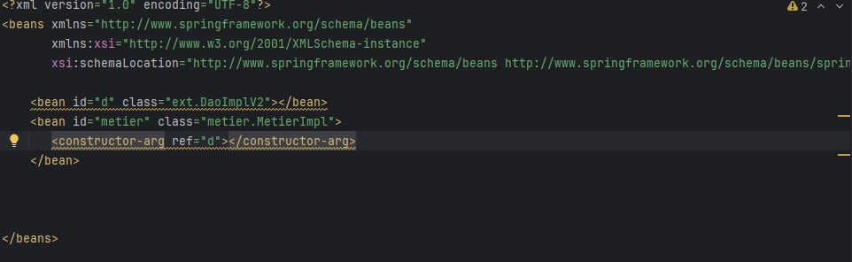
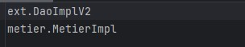

<h2> Injection des dépendance et Inversion de controle</h2>

<h2> fichier config.xml</h2>

<h2> fichier config.txt</h2>

<h2> Resultat  d'injection des dépendances  Par instanciation statique </h2>

<h2> Resultat  d'injection des dépendances  Par instanciation dynamique </h2>

<h2> Resultat  d'injection des dépendances  En utilisant le Framework Spring </h2>
<ul>
<li>
Version XML
</li>

<li>
Version annotations
</li>

</ul>

